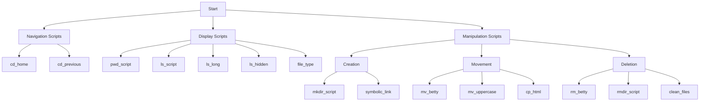

# Basic Shell Scripts

## Author
Frédéric Bourouliou

## Description
This repository contains a collection of basic shell scripts for file and directory manipulation in Linux/Unix.

## List of Scripts

1. **pwd_script** - Prints the absolute path of the current working directory
2. **ls_script** - Displays the contents of the current directory
3. **cd_home** - Changes the working directory to the user's home directory
4. **ls_long** - Displays current directory contents in long format
5. **ls_hidden** - Displays current directory contents, including hidden files
6. **ls_current** - Displays current directory contents
7. **mkdir_script** - Creates a directory named "my_first_directory"
8. **mv_betty** - Moves the file "betty"
9. **rm_betty** - Deletes the file "betty"
10. **rmdir_script** - Deletes the directory "my_first_directory"
11. **cd_previous** - Changes the working directory to the previous one
12. **ls_all** - Lists all files
13. **file_type** - Prints the type of the file named "iamafile"
14. **symbolic_link** - Creates a symbolic link to /bin/ls
15. **cp_html** - Copies all HTML files to the parent directory
16. **mv_uppercase** - Moves all files beginning with an uppercase letter
17. **clean_files** - Deletes all files in the current working directory
18. **mkdir_tree** - Creates the directories "welcome"

## Operations Flowchart


## Usage
Each script can be executed individually using the command:
```bash
./script_name
```

## Note
Make sure the scripts have the appropriate execution permissions. You can set them using:
```bash
chmod +x script_name
```

## Features
- Directory navigation and manipulation
- File operations (creation, movement, deletion)
- Directory listing with various options
- File type checking
- Symbolic link creation
- Batch file operations

## Requirements
- Unix/Linux operating system
- Bash shell
- Execute permissions on scripts

## License
This project is under free license.
