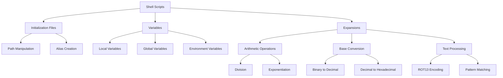

# Shell, Init Files, Variables and Expansions

This project is a collection of shell scripts focusing on initialization files, variables, and expansions in Unix/Linux systems. Each script demonstrates different aspects of shell scripting and environment manipulation.

## Author
* **Frédéric Bourouliou**

## Project Overview
This repository contains scripts that showcase various shell concepts including:
- Shell initialization files
- Variables (local and global)
- Shell expansions and arithmetic
- Command aliases
- Technical writing

## Scripts Description

* **0-alias**: Creates an alias for the `ls` command
* **1-hello_you**: Prints "hello" followed by the current Linux user
* **2-path**: Adds `/action` to the PATH environment variable
* **3-paths**: Counts the number of directories in the PATH
* **4-global_variables**: Lists environment variables
* **5-local_variables**: Lists all local variables, environment variables, and functions
* **6-create_local_variable**: Creates a new local variable
* **7-create_global_variable**: Creates a new global variable
* **8-true_knowledge**: Performs arithmetic expansion with environment variables
* **9-divide_and_rule**: Performs division using environment variables
* **10-love_exponent_breath**: Displays the result of an exponentiation
* **11-binary_to_decimal**: Converts a binary number to decimal
* **12-combinations**: Generates combinations of letters
* **13-print_float**: Prints a number with two decimal places
* **14-decimal_to_hexadecimal**: Converts decimal to hexadecimal
* **15-rot13**: Encodes and decodes text using rot13 encryption
* **16-odd**: Prints every other line from the input
* **17-water_and_stir**: Performs base conversion operations

## Project Flowchart

## Requirements
* All scripts are tested on Ubuntu 20.04 LTS
* All scripts are exactly 3 lines long
* All files end with a new line
* The first line of all files is `#!/bin/bash`
* All files are executable
* No use of `&&`, `||`, or `;`
* No use of `bc`, `sed`, or `awk`
