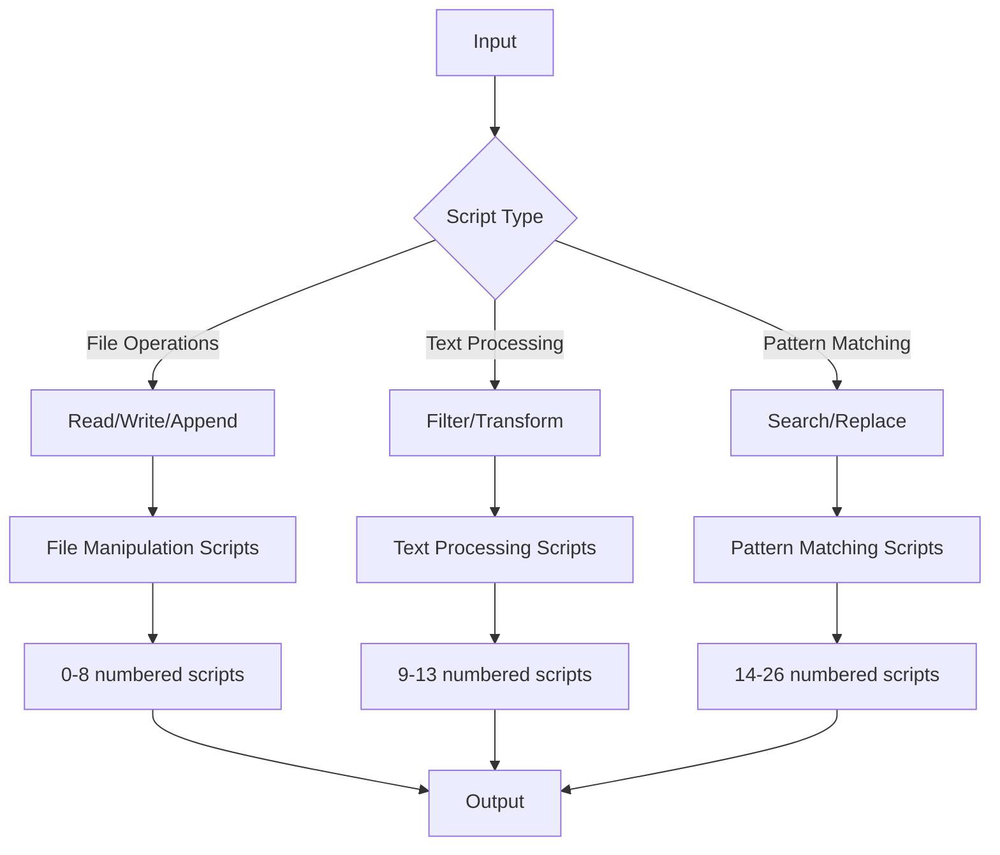

# Shell, I/O Redirections and Filters

This project is a collection of shell scripts focusing on I/O redirections and filters in Unix-like operating systems. Each script demonstrates different aspects of file manipulation, text processing, and data filtering using shell commands.

## Project Overview

The scripts in this repository cover various shell operations including:
- Basic file operations (reading, writing, appending)
- Text manipulation and filtering
- Pattern matching and regular expressions
- Directory navigation and file counting
- Advanced text processing

## Scripts Description

* `0-hello_world`: Prints "Hello, World" to the standard output
* `1-confused_smiley`: Displays a confused smiley
* `2-hellofile`: Display the content of /etc/passwd
* `3-twofiles`: Display the content of two files
* `4-lastlines`: Display the last lines of a file
* `5-firstlines`: Display the first lines of a file
* `6-third_line`: Displays the third line of a file
* `7-file`: Creates a file with special characters in its name
* `8-cwd_state`: Writes the result of ls -la into a file
* `9-duplicate_last_line`: Duplicates the last line of a file
* `10-no_more_js`: Deletes all regular files with .js extension
* `11-directories`: Counts directories and sub-directories
* `12-newest_files`: Displays the newest files in the current directory
* `13-unique`: Prints words that appear exactly once
* `14-findthatword`: Display lines containing a specific pattern
* `15-countthatword`: Count number of lines matching a pattern
* `16-whatsnext`: Display lines containing pattern and 3 lines after
* `17-hidethisword`: Display lines that do not contain a specific pattern
* `18-letteronly`: Display lines starting with a letter
* `19-AZ`: Replace characters A and c with Z and e respectively
* `20-hiago`: Remove specific letters from input
* `21-reverse`: Reverse input
* `22-users_and_homes`: Display users and their home directories
* `23-empty_casks`: Find empty files and directories
* `24-gifs`: List all GIF files
* `25-acrostic`: Decode acrostic poems
* `26-the_biggest_fan`: Parse web server logs

## Usage

Each script is executable and can be run from the command line. For example:

```bash
./0-hello_world
```

Make sure to give execution permissions to the scripts:

```bash
chmod +x script-name
```

## Requirements

* Linux/Unix-like operating system
* Bash shell
* Basic understanding of shell commands and operations

## Author

* **Frédéric Bourouliou**

## Flowchart


