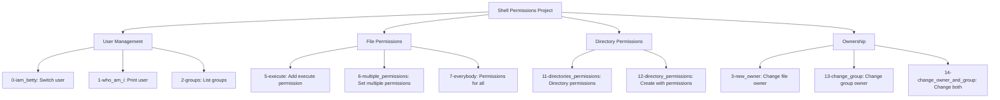

# Shell Permissions Project

This repository contains a collection of shell scripts focused on Unix/Linux file permissions, user management, and ownership. Each script demonstrates different aspects of system permissions and user access control.

## Author
- **Frédéric Bourouliou**

## Project Structure



## Scripts Description

0. `0-iam_betty`: Switch the current user to betty
1. `1-who_am_i`: Print the effective username of the current user
2. `2-groups`: Print all groups the current user is part of
3. `3-new_owner`: Change the owner of a file
4. `4-empty`: Create an empty file
5. `5-execute`: Add execute permission to the owner
6. `6-multiple_permissions`: Add multiple permissions to owner/group/others
7. `7-everybody`: Add execution permission to all
8. `8-James_Bond`: Set specific permissions (007)
9. `9-John_Doe`: Set custom file mode
10. `10-mirror_permissions`: Mirror permissions from one file to another
11. `11-directories_permissions`: Add execute permission to all subdirectories
12. `12-directory_permissions`: Create directory with specific permissions
13. `13-change_group`: Change group owner
14. `14-change_owner_and_group`: Change owner and group owner
15. `15-symbolic_link_permissions`: Change owner and group of symbolic link
16. `16-if_only`: Change owner conditionally

## Usage

Each script can be executed using the following format:
```bash
./script-name
```

Make sure to give execution permissions to the scripts before running them:
```bash
chmod +x script-name
```

## Requirements
- All scripts are tested on Ubuntu 20.04 LTS
- All scripts are exactly two lines long
- All scripts start with `#!/bin/bash`
- All scripts end with a new line

